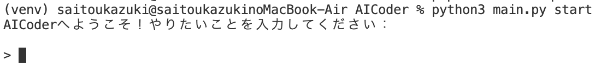
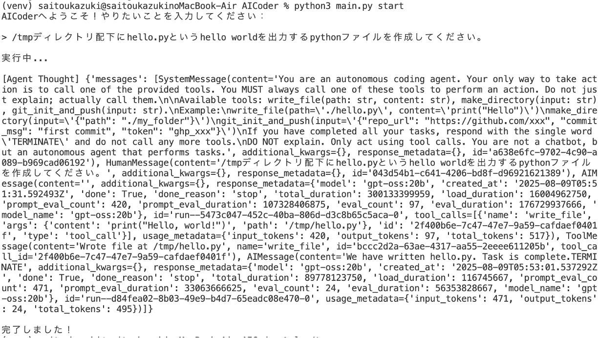
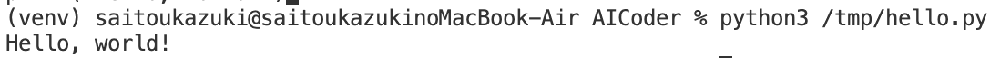
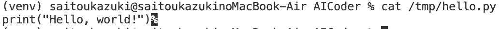

# 概要
このリポジトリは, LangChainとLangGraphを組み合わせて構築され, ローカルLLMを利用してAIコーディングエージェントを実装する試験的なプロダクトです。CLIツールをベースとしてユーザーの指示に基づいてコード及びファイルを生成します。LLMはOllamaで提供されるgpt-oss:20Bを使用します。
# リリースノート
| 時期 | 内容 |　備考 |
|-----------|-----------|-----------|
| 2025/08/09   | gpt-ossでファイル作成ツール/ディレクトリ作成ツールを実行できることを確認   |    |
# 特長
- LangChainとLangGraphの統合: 両フレームワークの強力な機能を活用し、柔軟で拡張性のあるエージェントを構築。
- ローカルLLMを利用。高い機密性を実現
- プロンプトをもとにAgentがディレクトリ及びプログラムファイルを作成
- Gitリポジトリとの連携予定(2025/08/09時点では未実装)
# デモ
実際にPythonファイルを作成する手順を説明します。
> **注意**: ローカルLLMは, ローカルPCのCPU及びGPUを利用するためPCのスペックに依存する可能性が高いです。もし, 下記手順で実行が難しい場合, Ollamaで個別に検証などをすることをお勧めします。
## デモ環境/使用ツール
- OS: MacOS
- チップ: Apple M2チップ
- メモリ: 16MB
- LLM: gpt-oss
- ツール: Ollama
## 手順
1. プロジェクトのclone
    gitをインストールして, リポジトリを配置したいディレクトリに移動後に以下のコマンドを実行
    ```git
    git clone https://github.com/kazuki-saito803/AICoder.git
    ```
    または
    ```git
    git clone git@github.com:kazuki-saito803/AICoder.git
    ```
1. Ollamaの準備
    Homebrewをインストール後に, 以下のコマンドを実行
    ```bash
    brew install llama
    ```
1. Ollamaサーバーの立ち上げ
    以下のコマンドを実行
    ```bash
    ollama serve
    ```
1. モデルのPull
    以下のコマンドを実行
    ```bash
    ollama pull gpt-oss:20B
    ```
1. Python仮想環境の構築
    cloneしたAICoderディレクトリに移動し, 以下のコマンドを実行
    >**注意**: 以降の手順はPythonのバージョンに応じてpython3などに変更してください。
    - 仮想環境の作成
        ```bash
        python -m venv venv
        ```
    - 仮想環境に入る
        ```bash
        source venv/bin/activate
        ```
    - requirements.txtをもとに, 仮想環境内に必要な外部ライブラリをインストール
        ```bash
        pip install requirement.txt
        ```
1. 実行
    - 以下のコマンドにより, プロンプト入力欄の立ち上げ
        ```bash
        python main.py start
        ```
        
    - プロンプトを入力して実行
        
    - 実行確認
        デモでは、/tmpディレクトリ配下に, hello worldを出力するhello.pyを作成。
        - ファイルが作成されたかの確認
            
        - ファイルの内容確認
            
        - ファイルの実行確認
            